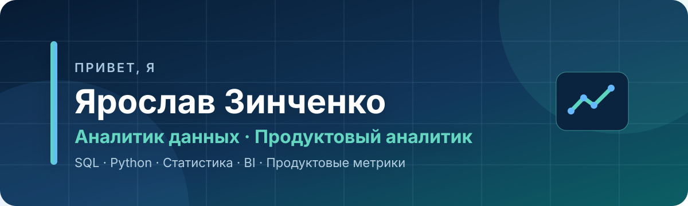
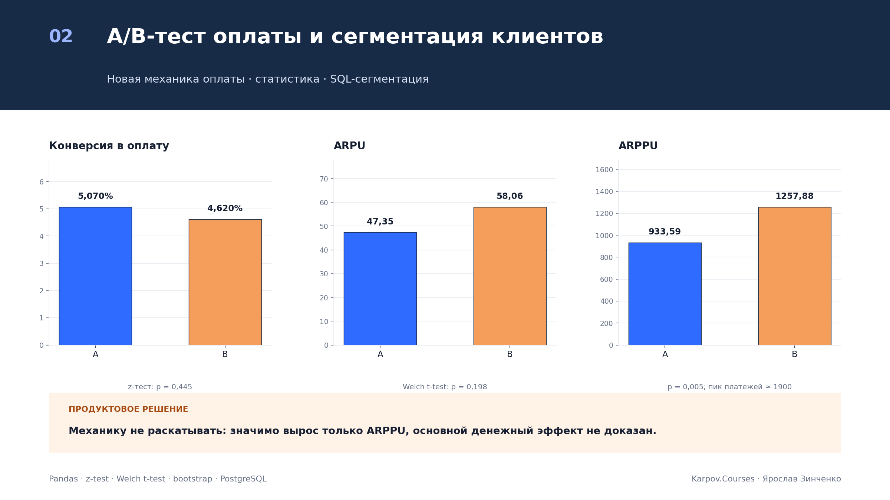

## 👋 Обо мне

Я **младший аналитик данных / продуктовый аналитик**. Анализирую продуктовые и бизнес-данные, строю аналитические витрины, проверяю качество данных и превращаю расчёты в понятные рекомендации.

- 🎓 Магистрант НИУ ВШЭ, перехожу в аналитику из востоковедения.
- 🔎 Ищу закономерности в поведении пользователей, продажах и продуктовых метриках.
- 🧪 Провожу A/B-тесты и отдельно проверяю качество эксперимента.
- 🧱 Работаю с SQL-витринами, когортным анализом, удержанием и RFM.
- 📊 Создаю дашборды и воспроизводимые аналитические ноутбуки.
- 💼 Открыт к позиции **младшего аналитика данных / продуктового аналитика**.

## 🛠️ Технологии и инструменты

### Анализ и статистика

`Python` · `pandas` · `NumPy` · `SciPy` · `A/B-тесты` · `bootstrap`

### SQL и базы данных

`PostgreSQL` · `ClickHouse` · `SQLite` · `CTE` · `оконные функции` · `соединение таблиц с контролем гранулярности`

### BI и визуализация

`DataLens` · `Tableau` · `Apache Superset` · `Excel` · `Matplotlib`

### Инженерные инструменты

`Git` · `Docker` · `Apache Airflow` · `Jupyter Notebook` · `REST API`

## 🤘 Что умею

- Формировать витрины на корректной гранулярности и контролировать размножение строк после JOIN.
- Рассчитывать ARPU, ARPPU, конверсию, удержание, отток, GMV, AOV и другие продуктовые метрики.
- Проводить A/B-тесты, бутстрэп, t-тесты и тесты для долей; интерпретировать не только `p-value`, но и размер эффекта.
- Проверять дубликаты, пропуски, уникальность ключей, ссылочную целостность и ограничения данных.
- Выполнять когортный анализ, RFM-сегментацию и исследование пользовательских воронок.
- Готовить аналитический вывод в цепочке **задача → данные → метод → результат → рекомендация → ограничения**.

## 📖 Избранные проекты

| Проект | Что сделано и найдено | Стек |
|---|---|---|
| 🛒 **[Аналитика Olist](https://github.com/sureasguuds9-prog/olist-ecommerce-analytics)** | PostgreSQL-витрина на уровне заказа, продажи, удержание, RFM, доставка и отзывы. На **96 478 заказах** доля повторных клиентов составила **3,00%**, а плохих отзывов при опоздании — **53,99% против 9,19%** при доставке вовремя. | PostgreSQL, SQL, Python, pandas, SciPy, DataLens |
| 📚 **[Аналитика роста StudyFlow](https://github.com/sureasguuds9-prog/studyflow-growth-analytics)** | Воспроизводимый SaaS/EdTech-кейс на синтетических данных: продуктовые этапы, когорты, юнит-экономика и A/B-тест. Умный онбординг повысил активацию на **16,89 п.п.**, а оплату — на **7,37 п.п.** | Python, pandas, SQL, SQLite, статистика, A/B-тесты |
| 👗 **[Рост и удержание TheLook](https://github.com/sureasguuds9-prog/thelook-growth-analytics)** | Сквозной аудит 100 тыс. пользователей: чистая выручка **$8,07 млн**, повторные покупки **30,4%**, удержание M1 **5,1%**. A/B-симуляция показывает, почему статистический рост конверсии ещё не равен выгодному запуску. | Python, pandas, BigQuery SQL, статистика |
| 🌍 **[Индекс инвестиционного климата MENA](https://github.com/sureasguuds9-prog/MENA-INVESTMENT-INDEX)** | Исследовательский индекс для **19 стран за 2000–2024 годы**: API, панель из **475 наблюдений**, фиксированные эффекты, Монте-Карло и Dash. Слабый бэктест честно зафиксирован как граница применимости модели. | Python, World Bank API, IMF API, панельные данные, Dash |
| 🎮 **[Продуктовая аналитика мобильной игры](https://github.com/sureasguuds9-prog/mobile-game-product-analytics)** | Когортное удержание и A/B-тест предложения. Набор B не рекомендован к запуску: ARPU вырос, но незначимо, а конверсия снизилась статистически значимо. | Python, pandas, SciPy, A/B-тесты |
| 🎓 **[ИИ в образовании](https://github.com/sureasguuds9-prog/ai-education-analyst)** | Разведочный анализ 50 тыс. наблюдений: умеренное использование ИИ связано с лучшим приростом GPA, а 20+ часов — с высоким риском выгорания. Причинные ограничения вынесены явно. | Python, pandas, SciPy, статистика |

## 📊 Проекты визуализации

### [Olist E-commerce Overview — Tableau](https://github.com/sureasguuds9-prog/olist-tableau-analytics)

Интерактивный дашборд для мониторинга продаж и качества исполнения заказов: **R$15,8 млн GMV**, **99 092 заказа**, динамика, Top-10 категорий, карта штатов, статусы и связь задержки доставки с оценкой клиента. Глобальные фильтры пересчитывают все KPI и визуализации.

[Репозиторий и методология](https://github.com/sureasguuds9-prog/olist-tableau-analytics) · [Скачать Tableau workbook](https://github.com/sureasguuds9-prog/olist-tableau-analytics/raw/main/tableau/olist_ecommerce_dashboard.twbx)

## 🎓 Учебные проекты Karpov.Courses

Три варианта финального проекта оформлены как воспроизводимые аналитические кейсы: с проверкой качества данных, расчётом продуктовых метрик, статистическими тестами, ограничениями и решением для бизнеса.

### 1. [Продуктовая аналитика мобильной игры](https://github.com/sureasguuds9-prog/mobile-game-product-analytics)

Когортное удержание, A/B-тест акционных предложений и метрики события. Набор B не рекомендован: рост ARPU не подтверждён, а конверсия снизилась значимо. 
[Репозиторий](https://github.com/sureasguuds9-prog/mobile-game-product-analytics) · [Ноутбук](https://github.com/sureasguuds9-prog/mobile-game-product-analytics/blob/main/notebooks/final_project_variant_1.ipynb) · [Отчёт](https://github.com/sureasguuds9-prog/mobile-game-product-analytics/blob/main/reports/final_report.md)

### 2. [A/B-тест оплаты и сегментация клиентов](https://github.com/sureasguuds9-prog/karpov-courses-projects/tree/main/project-2-payment-ab-segmentation)

CR, ARPU, ARPPU, bootstrap и SQL-сегментация. Значимо вырос только ARPPU, поэтому запуск механики без проверки пика платежей около 1900 не рекомендован. 
[Проект](https://github.com/sureasguuds9-prog/karpov-courses-projects/tree/main/project-2-payment-ab-segmentation) · [Ноутбук](https://github.com/sureasguuds9-prog/karpov-courses-projects/blob/main/project-2-payment-ab-segmentation/notebooks/project_2_full.ipynb) · [SQL](https://github.com/sureasguuds9-prog/karpov-courses-projects/blob/main/project-2-payment-ab-segmentation/sql/customer_segmentation.sql)

### 3. [A/B-тест цены премиум-подписки](https://github.com/sureasguuds9-prog/karpov-courses-projects/tree/main/project-3-premium-price-ab-test)

Проверка транзакций, A/A-контроль и A/B-тест новой цены. Конверсия снизилась, а рост ARPU статистически не подтверждён — новую цену не следует раскатывать. 
[Проект](https://github.com/sureasguuds9-prog/karpov-courses-projects/tree/main/project-3-premium-price-ab-test) · [Ноутбук](https://github.com/sureasguuds9-prog/karpov-courses-projects/blob/main/project-3-premium-price-ab-test/notebooks/project_3_variant_3.ipynb) · [Пошаговый разбор](https://github.com/sureasguuds9-prog/karpov-courses-projects/blob/main/project-3-premium-price-ab-test/docs/project_3_step_by_step_explanation.md)

➡️ **[Открыть все учебные проекты Karpov.Courses](https://github.com/sureasguuds9-prog/karpov-courses-projects)**

## 📫 Связаться со мной

